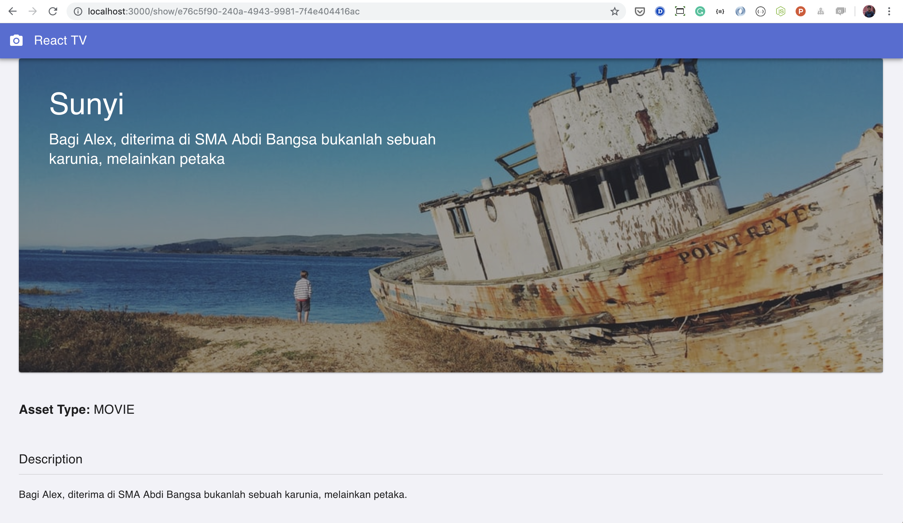

# React TV

## How to run

Node Version: v12.7.0

Navigate to project root directory and run `npm start`

Runs the app in the development mode. 
Open [http://localhost:3000](http://localhost:3000) to view it in the browser.

### Pages

- `http://localhost:3000` Display all the shows
- Click on any of the poster will lead to show detail page `http://localhost:3000/show/:id`

### Test Pagination

As of now pagination is manual

You can navigate to this URL `http://localhost:3000/?page=1&perPage=5` and try to manually change the `page` value to navigate the result set

### Demo

